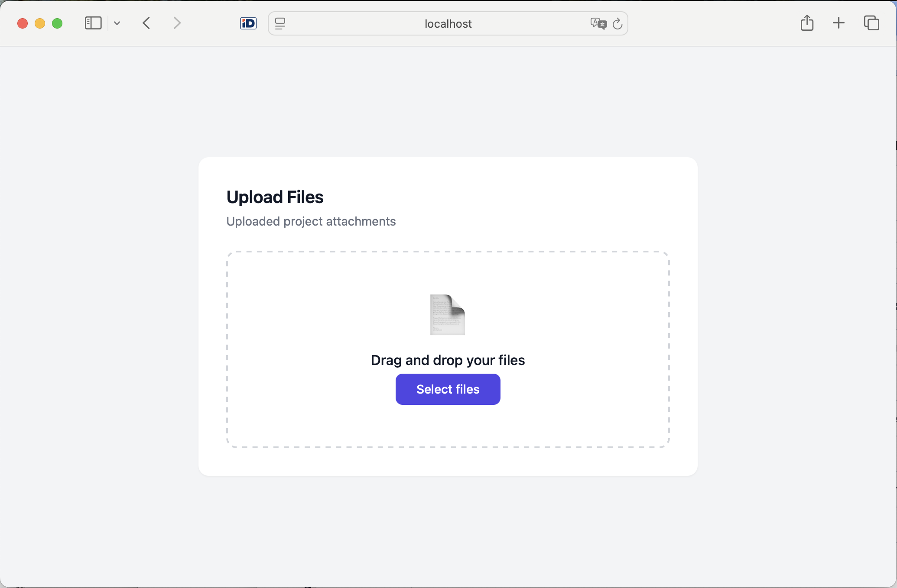
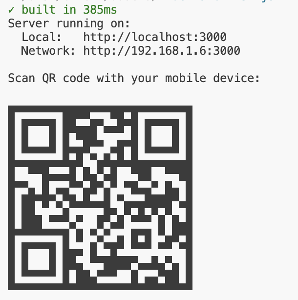
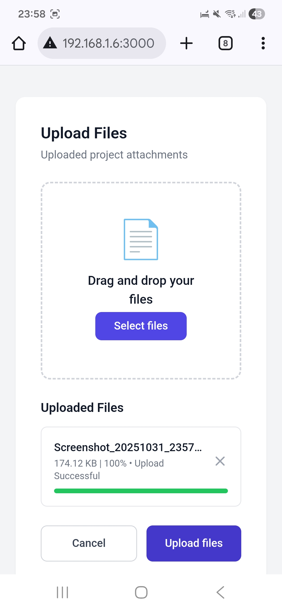

# QRUp

[](https://opensource.org/licenses/MIT)

Simple file uploader for local network use. Upload files from your mobile device to the server with QR code scanning for easy access.

> ⚠️ **Security Warning**: This application is designed for LOCAL NETWORK USE ONLY. Do NOT expose this server to the public internet without proper authentication and security measures.

## Table of Contents

- [QRUp](#qrup)
  - [Table of Contents](#table-of-contents)
  - [How It Works](#how-it-works)
    - [1. Start the Server](#1-start-the-server)
    - [2. Access from Desktop](#2-access-from-desktop)
    - [3. Access from Mobile](#3-access-from-mobile)
    - [4. Upload Files](#4-upload-files)
  - [Setup](#setup)
    - [Installation via Homebrew](#installation-via-homebrew)
    - [Manual Setup](#manual-setup)
  - [Requirements](#requirements)
  - [Release Process](#release-process)

## How It Works

### 1. Start the Server
When you run the application, a QR code is displayed in your terminal along with the local network URL:



### 2. Access from Desktop
Open the URL in your desktop browser to upload files locally:



### 3. Access from Mobile
Scan the QR code with your mobile device to instantly access the upload page:



### 4. Upload Files
- Drag and drop files onto the upload area
- Or click to select files from your device
- Files are saved to the `uploads` folder
- Works seamlessly on both desktop and mobile devices

## Setup

### Installation via Homebrew

**Requirements:**
- Node.js 22.18.0 or higher
- Bun runtime (https://bun.com/docs/installation)

```bash
brew tap totherush/tap
brew install qrup
```

**Usage:**
```bash
# Start with default settings (port 3000, uploads folder)
qrup

# Specify custom port and upload directory
qrup --port 8080 --upload /path/to/uploads

# Using short flags
qrup -p 8080 -u ./my-uploads
```

**CLI Options:**
- `--port, -p` - Server port (default: 3000)
- `--upload, -u` - Upload directory path, can be absolute or relative (default: uploads)

To update to the latest version:
```bash
brew untap totherush/tap
brew tap totherush/tap
brew update-reset
brew cleanup -s
brew fetch qrup --force
brew reinstall qrup
```

### Manual Setup

1. Install dependencies:
```bash
bun install
```

2. (Optional) Configure environment variables:
   - Copy `.env.example` to `.env`
   - Available environment variables:
     - `PORT` - Server port (default: 3000)
     - `UPLOAD_FOLDER` - Upload directory path (default: uploads)

3. Start the server:
   ```bash
   bun run dev
   ```
   Or for production:
   ```bash
   bun start
   ```

4. Access the upload page:
   - On the same device: http://localhost:3000
   - From mobile device: Scan the QR code displayed in the terminal

## Requirements

- Node.js 22.18.0 or higher
- Bun runtime installed on the server machine
- Both devices on the same local network

## Release Process

1. Ensure all changes are committed and pushed
2. Update version in [package.json](file:///Users/tobiastrusch/projects/upload-page/package.json)
3. Run the release command:
   ```bash
   bun run release
   ```
4. Review and commit the generated [CHANGELOG.md](file:///Users/tobiastrusch/projects/upload-page/CHANGELOG.md)
5. Create and push a git tag:
   ```bash
   git tag v0.1.2
   git push origin v0.1.2
   ```
6. Update the Homebrew formula with the new version and tarball SHA256
